# Pico2W DualSense 5 Bridge — OLED & LCD Edition

[English](./README.md)

> **本分支现已同时支持两种显示屏**：OLED（黑白，Pico-OLED-1.3）与 LCD（彩色，Pico-LCD-1.3，240×240 IPS）。每次构建产出两个固件：`ds5-bridge-oled.uf2` 与 `ds5-bridge-lcd13.uf2`，屏幕内容与按键操作完全一致。详见英文 README 的 “Display variants” 一节；本中文文档其余部分以 OLED 版为例。

> 将 Raspberry Pi Pico2W 变成 DualSense (DS5) 手柄的无线适配器 —— 并可选配板载状态显示屏。

> **OLED 版**是 **[awalol/DS5Dongle](https://github.com/awalol/DS5Dongle)**（上游）的一个分支，增加了可选的 Pico-OLED-1.3 128×64 显示屏插件，提供 11 个屏幕（状态、4 槽多手柄配对、带收藏与特效预设的灯条调色器、扳机测试、陀螺仪倾斜、触摸板、诊断、CPU/时钟、蓝牙信号强度、音频 VU 表，以及一个持久化设置菜单），外加 DS5 按键组合软重启。核心桥接固件以上游为权威来源；本分支跟踪上游并在其之上叠加插件功能。

---

## 🛠️ 网页配置工具

**[→ 打开 OLED 版网页配置](https://marcelinevpq.github.io/DS5Dongle-OLED-Config-Web/#config)**

网页工具是一站式方案 —— **无需安装、无需命令行、无需 `picotool`**。一块全新的 Pico 2 W 可以全程在浏览器里从"刚开箱"做到完整刷写并配置完成：

- **刷写固件标签页** —— 让 Pico 进入 **BOOTSEL 模式**，然后在浏览器中点击 *Connect to Pico*，再点 *Flash now*。站点会捆绑最新发布的 UF2，你也可以载入自己编译的本地 `.uf2`。基于 WebUSB。

  > **什么是 BOOTSEL 模式？** 这是 Pico 内置的刷写模式。进入方法：按住 Pico 上标有 **BOOTSEL** 的白色小按钮，*然后*插入 USB 线（若已插好，则在按住 BOOTSEL 的同时短暂拔插一次）。Pico 会作为可移动磁盘出现在电脑上 —— 看到它就说明已进入 BOOTSEL 模式。网页工具刷完固件后，Pico 会自动重启进入正常模式即可使用。
- **配置标签页** —— 设备刷好并重新连接后，可编辑振动增益、扬声器音量、轮询率、音频自动触感模式以及其余持久化设置；一键保存到设备闪存。基于 WebHID。
- **重映射标签页** —— 可视化按键重映射器：在实时 DualSense 示意图上点击某个按键即可把它重新指派为任意其他按键（肩键/扳机会以带标签的图标浮动到角落）。映射保存在设备上并在主机看到报告之前应用，因此在任何游戏、任何操作系统中都生效。基于 WebHID。
- **OLED 预览标签页** —— 像素级精确模拟全部 11 个 OLED 屏幕。用页面内的 KEY0/KEY1 按钮（或在 DualSense 配对时用手柄的 △ / R1 / 方向键）来导航。循环切换扳机测试预设时，自适应扳机会在手柄上真实触发。

可在任何基于 Chromium 的浏览器中使用（Chrome、Edge、Brave、Opera）。Firefox 与 Safari 不提供 WebHID 或 WebUSB，因此那里无法刷写和实时配置 —— 但 OLED 预览仍会用模拟数据渲染。

> 网页工具源码：**[MarcelineVPQ/DS5Dongle-OLED-Config-Web](https://github.com/MarcelineVPQ/DS5Dongle-OLED-Config-Web)**（[awalol/ds5dongle-config-web](https://github.com/awalol/ds5dongle-config-web) 的分支）。

---

## 概述

本项目让 Raspberry Pi Pico2W 作为 DualSense 手柄的蓝牙桥接器，实现无线连接并增强触感支持。

## 功能特点

**核心桥接（来自上游）：**

- 通过 Pico2W 完整连接 DualSense
- HD 触感（高级振动反馈）
- 无线蓝牙桥接
- 通过麦克风音量调节触感增益
- 可配置的 LED 与断连行为

**OLED 版新增：**

- 可选的 Pico-OLED-1.3 状态显示屏，含 **11 个屏幕**（状态、配对槽、灯条、扳机测试、陀螺仪倾斜、触摸板、诊断、CPU/时钟、RSSI、VU 表、设置）
- **按键重映射** —— 把 16 个数字控件（面板按键、方向键、肩键/扳机、摇杆按下、Create/Options）中的任意一个重新指派为其他按键。映射保存在设备上并在主机看到报告之前应用，因此在**任何游戏和操作系统中都无需任何主机端软件**即可生效；默认为恒等映射（无重映射）。可在[网页配置工具](#️-网页配置工具)的**重映射标签页**中可视化编辑，或通过 `scripts/remap_test.py` 无界面编辑。保存在专属闪存扇区，重启后保留。
- **4 槽持久化多手柄配对** —— 可绑定至多四个 DualSense，在 OLED 上切换，开机时自动重连槽 0
- **灯条调色器**，含 4 个用户收藏槽 + 呼吸 / 彩虹 / 渐变特效预设
- **持久化设置菜单**，涵盖 8 个固件配置字段（振动增益、扬声器音量、轮询率等），并提供按住确认的"重置"与"清除全部槽"操作
- **OLED 空闲省电阶梯** —— 手动亮度循环（长按 KEY1）、空闲 2 分钟自动深度变暗并显示一个呼吸小点、空闲 15 分钟完全熄屏。按键、手柄配对或输入时立即唤醒。是真正的防烧屏，而不只是调对比度。
- **软重启**，无需拔 USB：长按 DS5 的 `PS + Mute`（可无界面工作），或在 OLED 插件上**同时按住 KEY0 + KEY1 持续 1 秒**（取代了旧的 KEY0 双击手势 —— 快速翻页时容易误触发）
- **核心桥接的审计修复** —— 修复音频路径中关键的栈溢出（解决长期存在的"音频卡顿"）、安全加固、看门狗、HID/L2CAP 边界处的长度校验（见 [CHANGELOG.md](./CHANGELOG.md)）

## 硬件

### 必需

| 物品 | 说明 | 大致价格 |
|---|---|---|
| **Raspberry Pi Pico 2 W** | 搭载 RP2350 MCU，板载 CYW43 蓝牙/WiFi。[官方产品页](https://www.raspberrypi.com/products/raspberry-pi-pico-2/) | 约 $7 USD |
| **索尼 DualSense 手柄** | 任何标准 PS5 DualSense（VID `054C:0CE6`）。 | — |
| **USB-C 线缆** | 将 Pico 2 W 连接到主机 PC。 | — |

### 可选（强烈推荐）

| 物品 | 说明 | 大致价格 |
|---|---|---|
| **Waveshare Pico-OLED-1.3** | 128×64 SH1107 OLED 插件板（SKU HIPI1798）。直接插到 Pico 2 W 排针上。固件检测到时自动驱动，缺失时优雅地不做任何动作。[产品页](https://www.waveshare.com/pico-oled-1.3.htm) · [Wiki](https://www.waveshare.com/wiki/Pico-OLED-1.3) | 约 $6 USD |
| **小散热片**（用于 RP2350） | 固件将 MCU 超频到 320 MHz @ 1.20 V（见[性能 / 超频](#性能--超频)）。持续游玩时小散热片或导热垫有帮助。 | $1–3 USD |

### 哪里购买

Pico 2 W 与 Waveshare Pico-OLED-1.3 在全球都很容易买到：

- **Adafruit**、**Pimoroni**、**The Pi Hut**、**DigiKey**、**Mouser** —— 主要电子元件分销商（美/欧）
- **Waveshare 自营商店** 购买 OLED 插件
- 各地区 **Amazon** 店面 —— 搜索 `Raspberry Pi Pico 2 W` 与 `Waveshare Pico-OLED-1.3`（或 SKU `HIPI1798`）
- **AliExpress（速卖通）** —— 原装 Waveshare 与 Pico 货源以及克隆品；注意查看卖家评分

## 快速开始

### 刷写固件

1. 按住 Pico2W 上的 BOOTSEL 按钮
2. 通过 USB 将 Pico2W 连接到电脑
3. 设备会挂载为 USB 存储设备
4. 将 .uf2 固件文件拖放到该设备上

### 配对手柄

1. 让 DualSense 手柄进入蓝牙配对模式
2. 等待 Pico2W 检测并连接
3. 连接后，设备会出现在主机系统中

## 配置

有四种方式配置固件：

**网页配置（推荐，任何基于 Chromium 的浏览器）：** 在 Chrome、Edge、Vivaldi、Brave 或 Opera 中打开 **[DS5 Bridge Config — OLED Edition](https://marcelinevpq.github.io/DS5Dongle-OLED-Config-Web/)**（不支持 Firefox —— Mozilla 拒绝实现 WebHID）。点击 **Connect**，在浏览器对话框中选择 DualSense，然后用熟悉的表单界面编辑任意字段。页面通过 WebHID 直接与 Pico 通信 —— 无驱动、无安装，数据不离开你的机器。源码见 [MarcelineVPQ/DS5Dongle-OLED-Config-Web](https://github.com/MarcelineVPQ/DS5Dongle-OLED-Config-Web)。

**设备端（已装 OLED 插件）：** 使用屏上的**设置**菜单（第 11 个屏幕）。方向键 ▲▼ 移动选择，▶◀ 调整数值，△ 保存到闪存。

**终端 CLI（任何系统、任何浏览器）：** 安装 hidapi，然后使用 `scripts/set_ds5.py`：

```bash
pip install hidapi
scripts/set_ds5.py                            # 显示当前配置
scripts/set_ds5.py --auto-haptics fallback    # 修改某字段并持久化到闪存
scripts/set_ds5.py --speaker-volume -10 --haptics-gain 1.5
scripts/set_ds5.py --slot 2                   # 切换活动多槽配对
scripts/set_ds5.py --version                  # 固件版本
scripts/set_ds5.py --rssi                     # 实时蓝牙 RSSI（dBm）
scripts/set_ds5.py --help                     # 完整参数列表
```

该脚本通过 USB HID 特性报告 `0xF6`/`0xF7`/`0xF8`/`0xF9` 与固件通信 —— 在 Linux、macOS、Windows 的任何终端下都可用，与你用哪个浏览器无关。移植自 [loteran/DS5Dongle](https://github.com/loteran/DS5Dongle) 并为本分支的 `current_slot` 字段做了扩展。

**DualSense 手柄按键（旧式后备方案，无 OLED、无 CLI）：**

### 麦克风音量

控制触感增益倍率。范围：`[1.0 – 2.0]`。

### 扬声器静音

禁用 LED 连接指示灯。手柄重连后生效。

### 麦克风静音

禁用静默断连行为。

## 注意事项

只有在手柄连接之后，Pico 设备才会对系统可见

某些行为需要经过重连周期才会生效

### 低电量 LED 指示

当所连 DualSense 报告其电量等于或低于 10%（且未在充电）时，Pico 板载 LED 会从常亮切换为 1 Hz 闪烁，让你一眼看到警告。一旦手柄插上充电或其报告电量回升，LED 恢复常亮。即使设置了 `disable_pico_led`，该闪烁也会触发 —— 该警告被视为关键，会覆盖 LED 关闭偏好；电量恢复或手柄开始充电后，LED 回到其禁用（熄灭）状态。

如需在编译期退出此功能，用 `-DENABLE_BATT_LED=OFF` 配置。默认为 ON。

## 蓝牙 DualSense 麦克风

**DualSense 的内置麦克风可通过适配器的蓝牙配对工作**（自 v0.6.8 起）。手柄将麦克风以 Opus 音频流式传输；适配器解码后作为标准 DualSense USB 采集设备呈现给主机，因此任何应用（Discord、OBS、游戏内语音）都能像普通麦克风一样使用它。

这一度被认为不可能实现 —— 本分支早期版本曾将其记录为索尼固件的硬性限制（Linux 的 `hid-playstation` 内核驱动至今仍不支持）。结果发现它取决于适配器外发音频报告中的一个使能位。**完全归功于 [awalol](https://github.com/awalol/DS5Dongle)（上游）发现了它。** 更正后的调查记录见 [BLUETOOTH_AUDIO_NOTES.md](./BLUETOOTH_AUDIO_NOTES.md)。

**使用方法：**

- **默认开启。** 配对手柄后一两秒内麦克风便开始流式传输 —— 无需游戏音频（适配器会自行保活该流）。
- **在主机端调高采集音量** —— 它默认很低。在 Linux 上，用 `arecord -l` 找到声卡，然后例如 `amixer -c <DualSense 声卡> sset 'Headset' 90%`。用 `scripts/mic_diag.sh capture` 验证采集。
- **关闭它以节省手柄电量** —— OLED **设置 → BT Mic**，或[网页配置工具](#️-网页配置工具)中的 **BT microphone** 开关。常开麦克风会让 DS5 的音频子系统保持唤醒，明显加快耗电，所以不用语音时请关闭。

**注意点：**

- 麦克风音频为**单声道**（解码为单声道，在立体声采集端点上复制）。
- 会话中途关闭会立即停止主机端的馈送，但手柄会持续流式传输直到下次重连（目前没有已知的"停止"命令）；以关闭状态全新连接则永远不会启用它。
- OLED **诊断**屏幕的 `Mic in:` 计数器在麦克风流式传输时约为 ~100/s —— 是确认它在工作的快捷方式。
- **丢包隐藏：** 丢失的麦克风帧（蓝牙链路弱、距离远、干扰）会用 Opus PLC 隐藏，使语音保持连续而不卡顿/中断，代价是少量抖动缓冲延迟（~30 ms）。诊断屏的 `Mic PLC:` 计数器仅在隐藏帧时增长 —— 实质上是一个实时链路质量计。

## 已知问题

- 超频到 320 MHz @ 1.20 V 是稳定蓝牙配对所**必需**的。把电压降到 1.10 V 或时钟降回默认会破坏 CYW43 PIO SPI 总线，蓝牙将停止工作。持续游玩时建议在 RP2350 上加小散热片。
- 在 Linux + Steam 上，HD 触感未必在每个游戏中都触发；这是游戏侧问题（部分作品仅在 Windows 专用 API 下发送 HD 触感音频）。在《漫威蜘蛛侠：重制版》中测试可用；在《对马岛之魂》中未送达 —— 同一固件、同一手柄。
- **USB 3.0 端口可能干扰配对** —— 手柄可能卡在常亮的琥珀/黄色灯条上始终连不上，而同一适配器在 USB 2.0 端口上工作正常。这是射频干扰，并非固件 bug；见下文 [USB 3.0 端口与蓝牙干扰](#usb-30-端口与蓝牙干扰)。（自 v0.6.8 起，固件会自动重试卡住的连接而不是一直挂着，能恢复许多 —— 但非全部 —— 边缘情况。）

## USB 3.0 端口与蓝牙干扰

如果适配器在某个端口能用而在另一个不能用，**请先试试 USB 2.0 端口。** USB 3.0 端口（尤其是 USB 3.0 延长线）会发出以 2.4 GHz 附近为中心的宽带射频噪声 —— 正是适配器蓝牙电台与手柄通信所用的频段。这是业界有充分记录的问题（Intel，*"USB 3.0 Radio Frequency Interference Impact on 2.4 GHz Wireless Devices"*），并非本固件特有。该噪声会降低适配器蓝牙接收机的灵敏度，于是手柄可以开始连接（琥珀灯条）但链路太吵无法完成 —— 卡在黄色上。

缓解措施，大致按效果排序：

1. **把适配器插到 USB 2.0 端口**（往往是最简单的修复 —— 许多主板/机箱两者都有）。
2. **用一根短的 USB 2.0 延长线** 让适配器离 USB 3.0 端口/金属机箱几英寸远，改善对手柄的视线。要特别避免 USB 3.0 延长线。
3. **使用插在 USB 3.0 端口上的有源 USB 2.0 集线器** —— 集线器会把链路降速并增加距离。
4. **在靠近适配器处的线缆上夹一个磁环。**
5. **配对时让手柄更靠近 / 与适配器保持视线。**

固件会自行持续重试卡住的连接，因此灯条变琥珀后让它插着等约 10–20 秒，也许无需拔插即可恢复。

## 性能 / 超频

**你无需为此做任何事 —— 超频已内置在固件中。** 当你刷入本仓库的 UF2 时，Pico 2 W 会自动以下列设置启动。没有单独要运行的工具、没有要编辑的配置文件、没有要烧的熔丝。

内置设置：

- **电压：1.20 V**（`vreg_set_voltage(VREG_VOLTAGE_1_20)`）
- **时钟：320 MHz**（`set_sys_clock_khz(SYS_CLOCK_KHZ, true)`）

为何必需：在默认时钟/电压下，CYW43 PIO SPI 总线（固件用来与板载蓝牙芯片通信的通路）不可靠，配对会失败。320 MHz @ 1.20 V 是我们验证过能在本板上产生稳定蓝牙链路的最低组合。

如果你自己编译的构建无法启动（不常见 —— 仅当你改过源码时才相关），可尝试在 `src/main.cpp` 中略微提高电压或降低时钟。运行官方 UF2 发布版的最终用户无需改动此处。

持续游玩**建议**在 RP2350 上加小散热片，但配对或短时使用并不需要。

## 编译说明

从源码编译本项目：

1. 安装 Pico SDK 2.2.0（或更新版本）。编译使用 `pico_sdk_import.cmake`。
2. **在 Pico SDK 内将 TinyUSB 固定到 0.20.0**（`$PICO_SDK_PATH/lib/tinyusb`）。本项目的 `tusb_config.h` 使用了 `TUD_AUDIO_EP_SIZE` 的四参数形式，而 Pico SDK 2.2.0 捆绑的 0.18.0 版本没有它：
   ```bash
   cd "$PICO_SDK_PATH/lib/tinyusb"
   git fetch --tags
   git checkout 0.20.0
   ```
3. 用 CMake + Ninja（或 Make）配置并编译：
   ```bash
   cd /path/to/DS5Dongle
   cmake -S . -B build -G Ninja -DCMAKE_BUILD_TYPE=Release -DPICO_SDK_PATH="$PICO_SDK_PATH"
   cmake --build build --target ds5-bridge
   ```
4. UF2 会生成在 `build/ds5-bridge-oled.uf2`。照常用 BOOTSEL 刷写。

值得了解的编译标志：

- `-DENABLE_BATT_LED=ON`（默认）—— DS5 低电量时闪烁 Pico LED。
- `-DENABLE_SERIAL=ON` —— 将 printf 路由到 USB CDC 用于调试（默认 OFF；生产构建释放 UART）。
- `-DPICO_W_BUILD=ON` —— 为原版 Pico W 编译（去掉音频、降低时钟）。默认面向 Pico 2 W。

## 诊断与调试工具

排查桥接问题有两种方式 —— 设备端通过 OLED 诊断屏幕，主机端通过 `scripts/mic_diag.sh`（Linux）。主机端更快：无需切屏、无需刷写周期，可在手柄正在使用时运行。

```
# 一次性快照 —— 适配器在 USB 上吗？ALSA 枚举到了吗？采集流在跑吗？当前有手柄配对吗？
scripts/mic_diag.sh status

# 对麦克风 IN 端点做 3 秒 arecord —— 报告峰值 / RMS / 非零计数，
# 以便区分"流是静音的"和"流在产生音频"。
scripts/mic_diag.sh capture 3

# 同 `status` 但循环运行，仅在状态变化时打印。可用于
# 捕捉配对完成或音频流开/关的确切时刻。
scripts/mic_diag.sh watch

# 实时读取固件的 0xFD 厂商特性报告（经由 /dev/hidraw）：
# 蓝牙输入计数与速率、最近见到的非 0x31 ID、字节前缀，以及
# 扳机流计数器（收到的主机 0x02 / 置了 AllowTriggerFFB 的 /
# 转发到蓝牙的）。bt-trace 会给出结论 —— "主机驱动没有发送
# 扳机 Allow 位" 还是 "已转发但手柄未触动" —— 这原本需要
# USB 协议分析仪才能判断。
scripts/mic_diag.sh bt-trace
```

最初是为排查被搁置的 DS5 蓝牙麦克风调查而写的（见 [BLUETOOTH_AUDIO_NOTES.md](./BLUETOOTH_AUDIO_NOTES.md)）。`0xFD` 特性报告与 `bt-trace` 解码器现在还携带为 [issue #3](https://github.com/MarcelineVPQ/DS5Dongle-OLED-Edition/issues/3)（部分游戏缺少自适应扳机张力）新增的扳机流计数器。

## OLED 显示插件（可选）

如果你把 [Waveshare Pico-OLED-1.3](#硬件) 插到 Pico2W 的排针上，固件会自动将其作为实时状态显示屏驱动。无需任何配置 —— 没有 OLED 时固件会优雅地不做动作。

### 开机启动画面（上电后 1.5 秒）

空屏居中显示固件版本 1.5 秒，然后跳转到状态屏幕。

### 11 个屏幕，用插件上的 KEY0 循环

循环顺序：**状态 → 配对槽 → 灯条 → 扳机测试 → 陀螺仪倾斜 → 触摸板 → 诊断 → CPU/时钟 → 蓝牙信号 → VU 表 → 设置 →** 回绕。**短按 KEY0 前进；短按 KEY1 后退** —— 在*每个*屏幕上都如此。各屏幕内的交互（循环扳机预设、循环灯条模式、移动设置光标、切换槽）都放在 **DualSense 手柄按键**上，绝不放在 KEY0/KEY1 上，因此 OLED 插件上这两个物理按键始终表示同一含义。

每个屏幕还会在左上边缘（KEY0 旁）画 **`>`**、在左下边缘（KEY1 旁）画 **`<`**，让屏上标签与按键在物理上配对。

#### 1. 状态

连接状态、已配对 DualSense 的蓝牙地址、带条形的电量百分比（`+` 充电中 / `*` 已充满 / `!` 错误）、实时摇杆位置（按下 **L3 / R3** 时，对应的摇杆框会反色闪烁 —— 白底黑点 —— 直到松开）、方向键、面板按键（△ ◯ ✕ □）、L1/R1，以及 L2/R2 模拟扳机填充条。链路指示与电量使用小像素图标。充电时，电池旁会显示到 100% 的预计时间 `~Nm`。

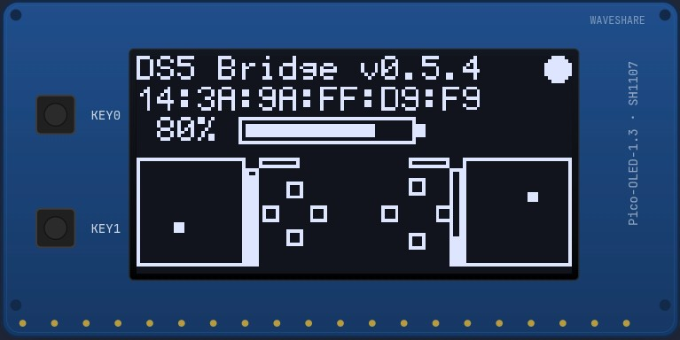

#### 2. 配对槽

持久化 4 槽多手柄配对。浏览已存手柄、切换活动槽，或清除单个槽。`>` 是光标，`*` 标记当前活动槽。

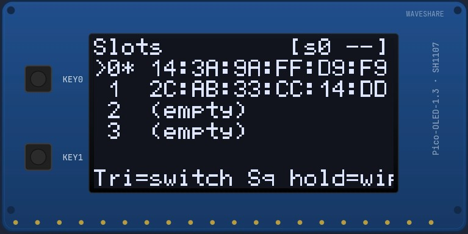

- **方向键 ▲▼** —— 在槽 0–3 间移动光标
- **△** —— 切换到光标所在槽（断开当前，重连到该槽存储的手柄）
- **□ 按住 1.5 秒** —— 清除光标所在槽（删除 bd_addr + BTstack 链路密钥）
- 活动槽会被持久化；适配器下次开机时重连到它

#### 3. 灯条调色器

在各轴上倾斜手柄来调出 R / G / B；固件以 10 Hz 把得到的颜色发送到 DualSense 实际的灯条，因此灯条本身就是可视预览（OLED 是单色的）。

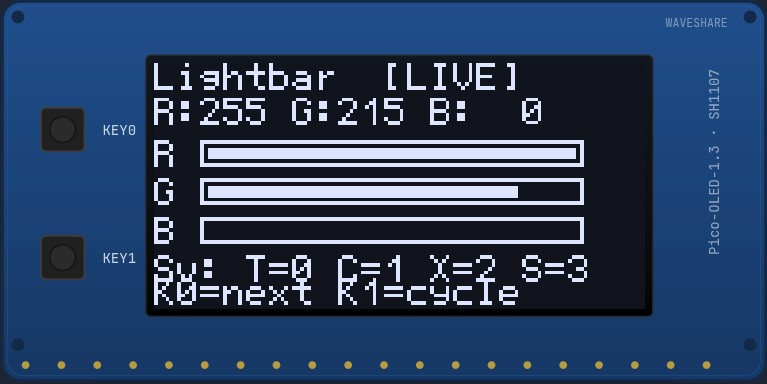

- 在手柄上按 **△ ◯ ✕ □** 把当前颜色**保存**到收藏槽 0 / 1 / 2 / 3
- 在手柄上按 **R1** 循环模式标签：`[LIVE]` → `[FAV0]` → `[FAV1]` → `[FAV2]` → `[FAV3]` → 特效（呼吸 / 彩虹 / 渐变）→ 回到 `[LIVE]`
- 默认收藏：红、绿、蓝、白

#### 4. 扳机测试

在手柄上按 **△** 循环七种应用到 L2 和 R2 的自适应扳机效果。扣动各扳机来感受效果。

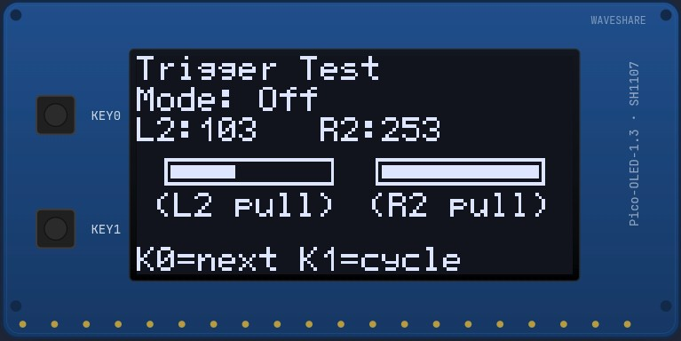

循环顺序：**关 → 反馈 → 武器 → 振动 → 弓 → 疾驰 → 机枪 → 关 …** 效果参数依据 [dualsensectl](https://github.com/nowrep/dualsensectl) 的逆向工程按位打包，全部为最大强度。

#### 5. 陀螺仪倾斜

实时 X/Y/Z 加速度计数值，配 40×40 十字准线框。点会实时跟随手柄的倾斜，并在手柄**平放时居中** —— 它使用手柄自带的逐台出厂 IMU 校准（从特性报告 `0x05` 解析），因此每个手柄的静止位置与增益都准确。向左/右、向前/后倾斜时，点会朝相应方向移动。

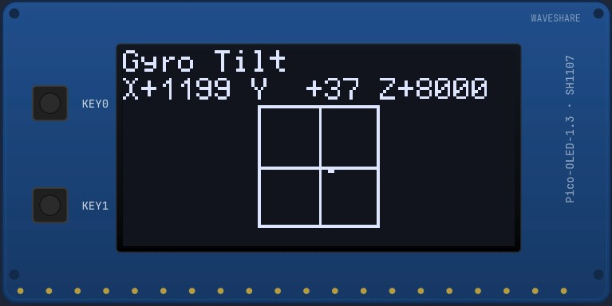

#### 6. 触摸板

触摸板表面的实时渲染。当前手指位置处出现圆点；计数随手指触碰/离开而更新。

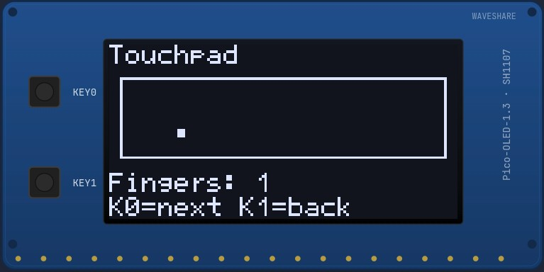

#### 7. 诊断

可滚动的实时计数器列表 —— 运行时间、蓝牙状态、主机 → 蓝牙扳机流（`host02` / `trig` / `tx`）、蓝牙 0x31 输入速率、USB 音频帧/秒、蓝牙 0x32 包/秒，底部还有被搁置的麦克风调查计数器。手柄方向键 ▲/▼ 滚动；右边缘的小 `^` / `v` 标记"上方/下方还有更多"。只读，所以没有光标。无需 UART 线即可验证桥接器在搬运字节。

同一批计数器也通过 HID 特性报告 `0xFD` 导出给主机端工具 —— 见下文 `scripts/mic_diag.sh bt-trace`。

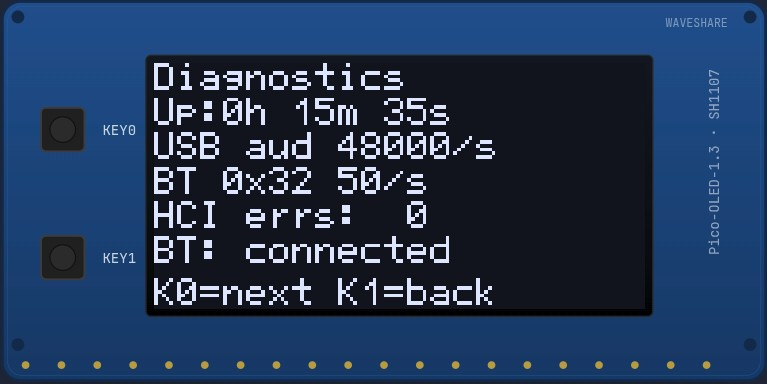

#### 8. CPU / 时钟

实时 RP2350 指标：配置的（`Set`）与实际运行的（`Real`）系统时钟（以晶振参考测量）、从稳压器回读的核心电压，以及片上温度（256 次采样平均 + 慢速 EMA，使数值跟踪真实芯片温度而非 ADC 噪声）。

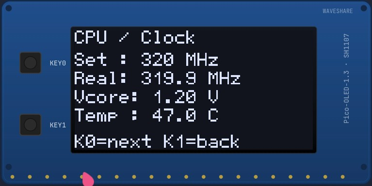

同样的遥测也通过 HID 特性报告 `0xFC` 导出给工具。

#### 9. 蓝牙信号

活动链路的实时蓝牙信号强度，以 dBm 显示并带条形。越接近 0 dBm 越强；−90 dBm 为弱。含定性标签（差 / 一般 / 好 / 极佳）。

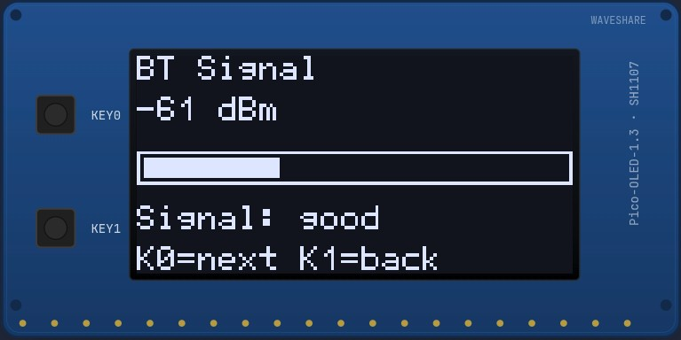

#### 10. VU 表

扬声器与触感音频路径的实时峰值表。可在手柄未插入主机时验证音频路由。

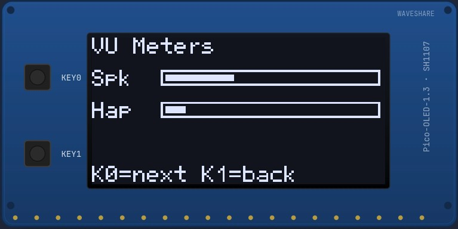

#### 11. 设置

持久化配置编辑器。方向键 ▲▼ 移动选择，▶◀ 调整数值，△ 保存到闪存。包含固件配置字段（振动增益、扬声器音量、空闲超时、轮询率）、音频自动触感控件，以及两个按住确认的操作：

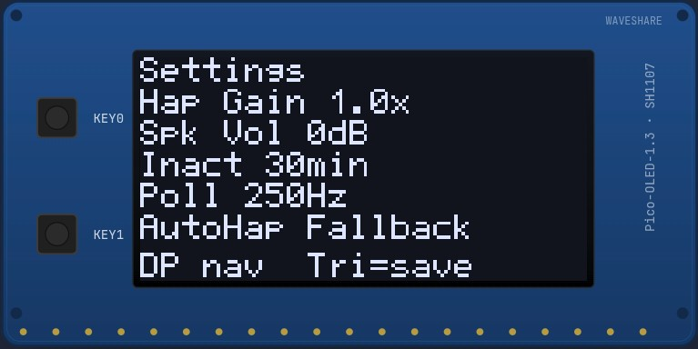

- **AutoHap Off / Fallback / Mix / Replace** —— 选择音频自动触感模式。默认 `Fallback` 仅在游戏不发送原生触感数据时（如 Linux 上的《对马岛之魂》）才触发派生震动；确实发送原生触感的游戏（《漫威蜘蛛侠：重制版》）则原样通过。`Mix` 在原生之上叠加派生，`Replace` 完全忽略原生，`Off` 禁用。
- **AH Gain N%** —— 派生信号增益，0–200%，10% 步进。默认 100%。
- **AH LP 80/160/250/400 Hz** —— 在包络跟随之前应用到扬声器音频的低通截止。越低越偏重低音，越高越偏临场感。默认 160 Hz。
- **Reset to defaults** —— 按住 △ 2 秒恢复所有配置字段
- **Wipe all slots** —— 按住 △ 2 秒删除全部 4 个已配对手柄 + 全部 BTstack 链路密钥

### 按键参考

OLED 插件上的两个物理按键**严格用于导航**：

| 按键 | 动作 |
|---|---|
| **KEY0** 短按 | 下一屏（前进） |
| **KEY1** 短按 | 上一屏（后退） |
| **KEY1** 长按（≥ 1.5 秒） | 循环 OLED 亮度等级 |
| **KEY0 + KEY1** 同时按住 ≥ 1 秒 | `watchdog_reboot` —— 无需拔 USB 的软重启 |

各屏幕内的状态变更（循环扳机预设、循环灯条模式、移动设置光标、切换槽、把颜色保存到收藏槽）全部发生在 **DualSense 手柄按键**上 —— 绝不在 KEY0 / KEY1 上 —— 因此这两个物理按键在每个屏幕上始终表示同一含义。各按键对应哪个手柄操作，见上文每个屏幕的小节。

### 引脚定义（标准 Waveshare Pico HAT 布局）

| 功能 | GPIO |
|---|---|
| MOSI | 11 |
| SCK  | 10 |
| CS   | 9  |
| DC   | 8  |
| RST  | 12 |
| KEY0 | 15 |
| KEY1 | 17 |

### 软重启恢复

两种无需拔 USB 重启适配器的方式 —— 配对卡住或想要干净状态时很方便：

- **OLED 上同时按住 KEY0 + KEY1 ≥ 1 秒** → `watchdog_reboot`。取代了早期版本的"KEY0 双击"手势，因为快速前进导航总会误触双击计时器。
- **按住 DualSense 的 `PS + Mute` 2 秒** → `watchdog_reboot`（无论是否装有 OLED 都可用 —— 无界面后备）。

## 致谢

本分支中的部分功能与设计思路借鉴自上游的其他分支，并予以致谢：

- **[zurce/DS5Dongle-OLED](https://github.com/zurce/DS5Dongle-OLED)** —— OLED 状态头部的像素图标（视觉方案）、设置屏 "Reset to defaults" 项使用的"按住以恢复出厂"交互模式（按住 △ 2 秒确认），以及新增配对槽屏上的多槽持久化蓝牙配对系统（4 个已绑定手柄、方向键导航、△ 切换槽、□ 按住清除某槽，外加设置菜单中的 "Wipe all slots"）。
- **[loteran/DS5Dongle](https://github.com/loteran/DS5Dongle)** —— 独立地重新发现了上游 `3a31bd7` 破坏扬声器/HD 触感输出的回归（提交 `c7a8d3c`）；我们 `src/audio.cpp` 中的修复恢复了同样的 SetStateData 子报告。也是音频自动触感 DSP（1 极点 LP + 包络跟随器，见 设置 → Auto Haptics）以及"不要把 USB 侧 UAC1 音量同步到持久化配置"修复的来源。
- **[awalol/ds5dongle-config-web](https://github.com/awalol/ds5dongle-config-web)** —— 我们分支版网页配置应用 [MarcelineVPQ/DS5Dongle-OLED-Config-Web](https://github.com/MarcelineVPQ/DS5Dongle-OLED-Config-Web) 的基础。该分支把上游的 Config_body 布局适配为我们的版本，并为我们的新增功能（多槽配对、Auto Haptics）添加了 UI。
- **[PS5 Button Icons and Controls](https://zacksly.itch.io/ps5-button-icons-and-controls)**（作者 **Zacksly**）—— 网页配置工具重映射标签页所用的 DualSense 控制器轮廓与按键图标，采用 [CC BY 3.0](https://creativecommons.org/licenses/by/3.0/) 授权（已重新着色为 `currentColor` 并裁剪以适配主题）。

## 路线图
- 请查看 [DS5Dongle plan](https://github.com/users/awalol/projects/5)

## 社区
- 加入 Discord 服务器：[Discord Server](https://discord.gg/hM4ntchGCa)
- 如果你遇到 bug，请改为开 issue。

## 参考
- [rafaelvaloto/Pico_W-Dualsense](https://github.com/rafaelvaloto/Pico_W-Dualsense) —— 项目灵感
- [egormanga/SAxense](https://github.com/egormanga/SAxense) —— 蓝牙触感 POC
- [https://controllers.fandom.com/wiki/Sony_DualSense](https://controllers.fandom.com/wiki/Sony_DualSense) —— DualSense 数据报告结构文档
- [Paliverse/DualSenseX](https://github.com/Paliverse/DualSenseX) —— 扬声器报告数据包
